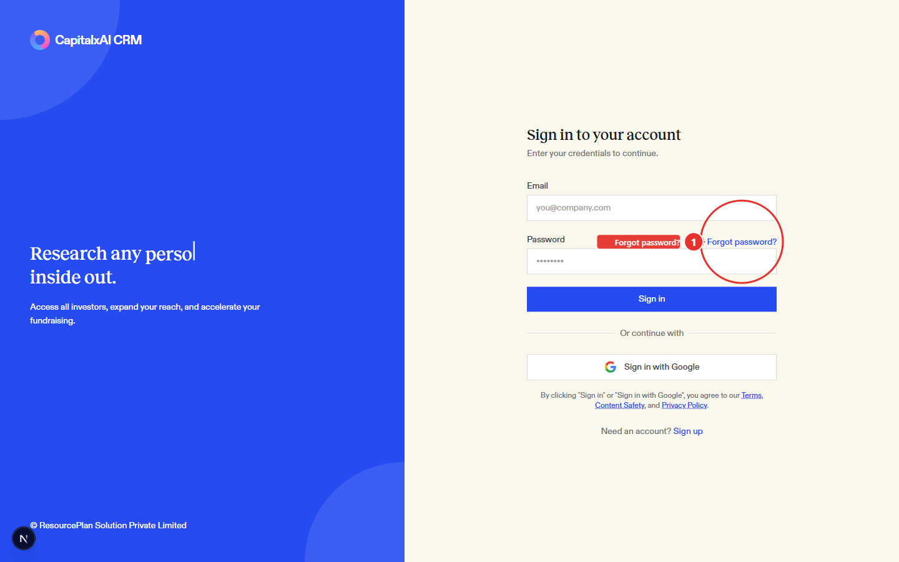
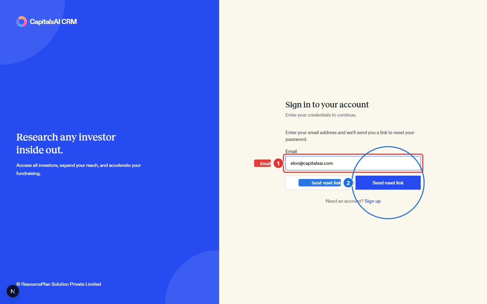

If you can't remember your password, you don't need an admin to reset it for
you — request a link from the sign-in page and set a new one yourself.

1. On the sign-in page, click **Forgot password?** (1), next to the Password
   field.

   

2. Enter the email address on your account (1) and click **Send reset link**
   (2).

   

   If an account exists for that address, you'll get a message confirming the
   link was sent. You won't be told whether the address matched an account —
   that's intentional, so the form can't be used to check who has one.

3. Open the email and click the reset link. It takes you to a **Reset your
   password** page where you enter a new password (at least 6 characters)
   and confirm it, then click **Update password**. You're redirected to the
   sign-in page automatically once it's saved.

## Notes

Reset links expire. If you open one that's too old, the reset page tells you
it's invalid and sends you back to sign-in to request a new one — so if it's
been a while since you asked for the email, request a fresh link rather than
reusing an old one.
